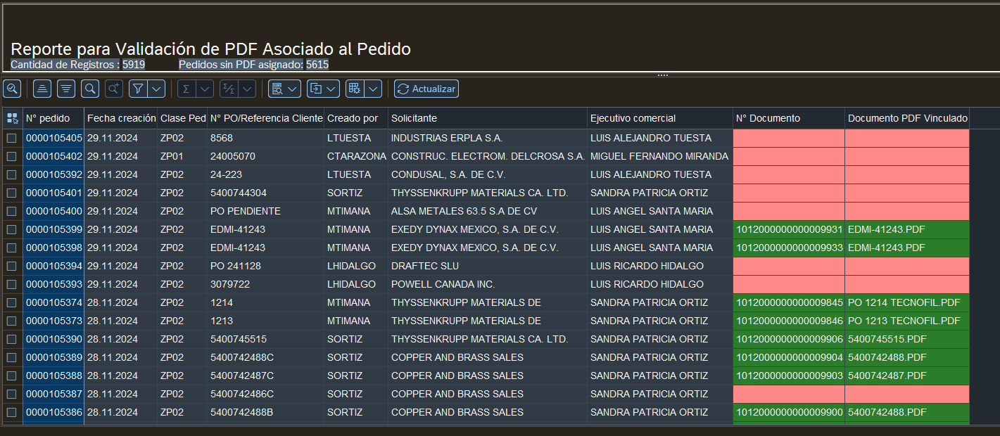

# ALV Report for PDF Validation Associated with Orders in SAP

## Problem or Justification:

Currently, there is no mandatory condition that ensures that a PDF file is attached when generating an order in the system. This creates problems in audit processes and makes it difficult to trace orders, as it is not clear which orders have associated documents and which do not.

This lack of visibility can cause delays in making critical decisions and affect other processes that directly depend on this information, such as returns management, delivery tracking or validation of contractual agreements. Additionally, the commercial area is directly impacted, as the absence of associated documents can lead to delays in customer service, loss of business opportunities and possible conflicts arising from incomplete or unverified information.

The implementation of this ALV report aims to facilitate the identification of orders that do not have an attached PDF, highlighting them visually (red if missing, green if present). This not only helps to ensure compliance with audit requirements, but also improves the efficiency of the commercial area and the reliability of internal processes, ensuring a better experience for customers.

## PROGRAM:

### INCLUDE ZSD_VAL_PDF_PEDIDOS_ALV_TOP

### INCLUDE ZSD_VAL_PDF_PEDIDOS_ALV_SEL.

### INCLUDE ZSD_VAL_PDF_PEDIDOS_ALV_CLS.
[Ver el código aquí](src/SD_VAL_PDF_PEDIDOS_ALV_CLS.ABAP)

### INCLUDE ZSD_VAL_PDF_PEDIDOS_ALV_MAI.

### INCLUDE ZSD_VAL_PDF_PEDIDOS_ALV_PBO.

### INCLUDE ZSD_VAL_PDF_PEDIDOS_ALV_PAI.

### INCLUDE ZSD_VAL_PDF_PEDIDOS_ALV_F01.

# ALV RESULT:

